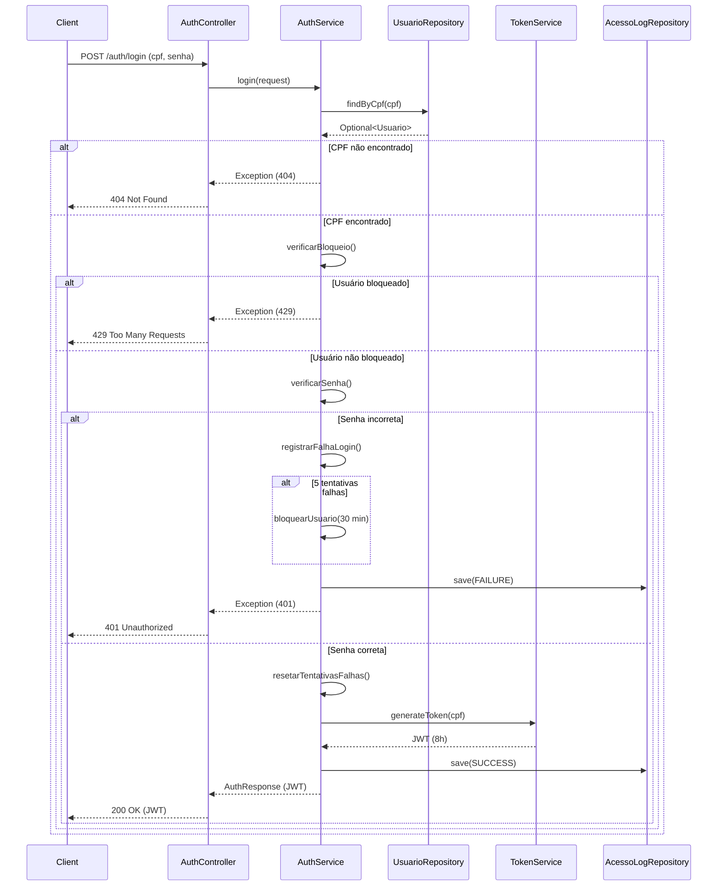
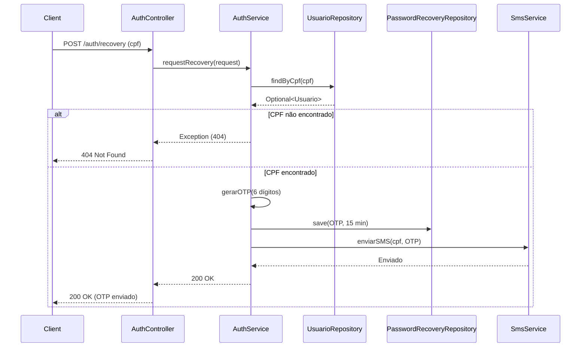
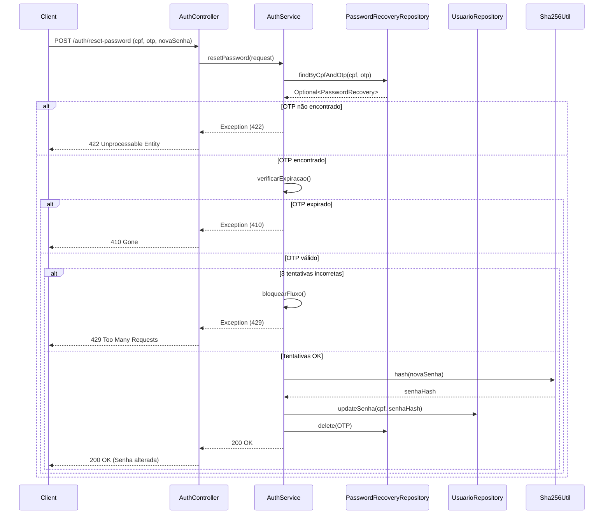
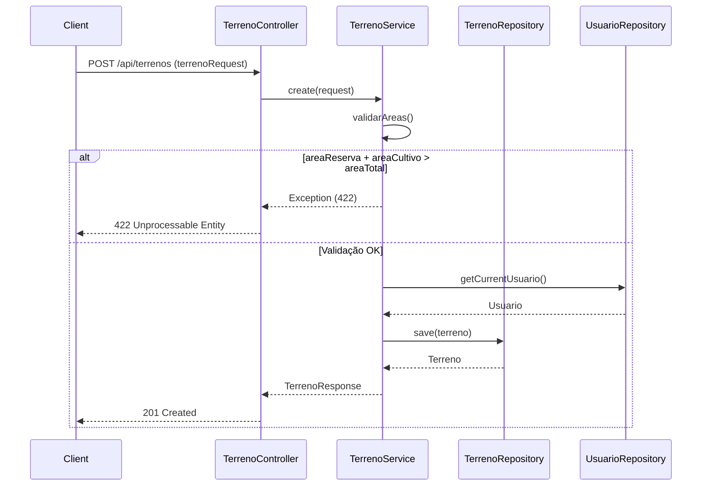
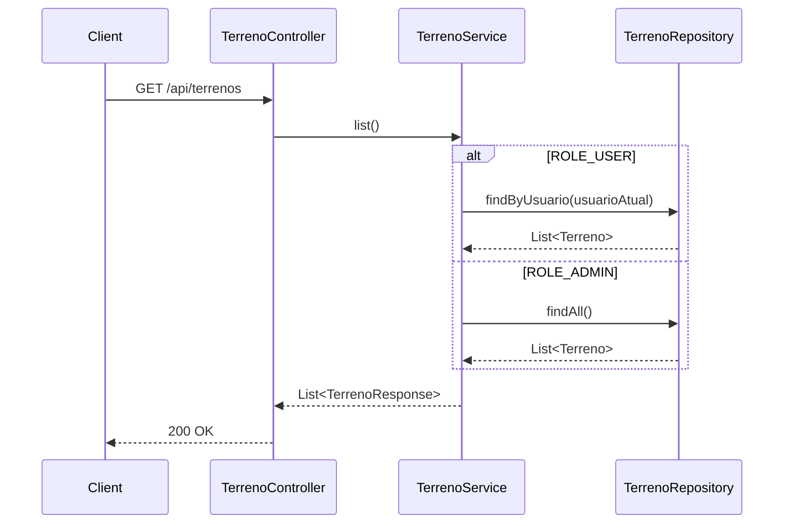
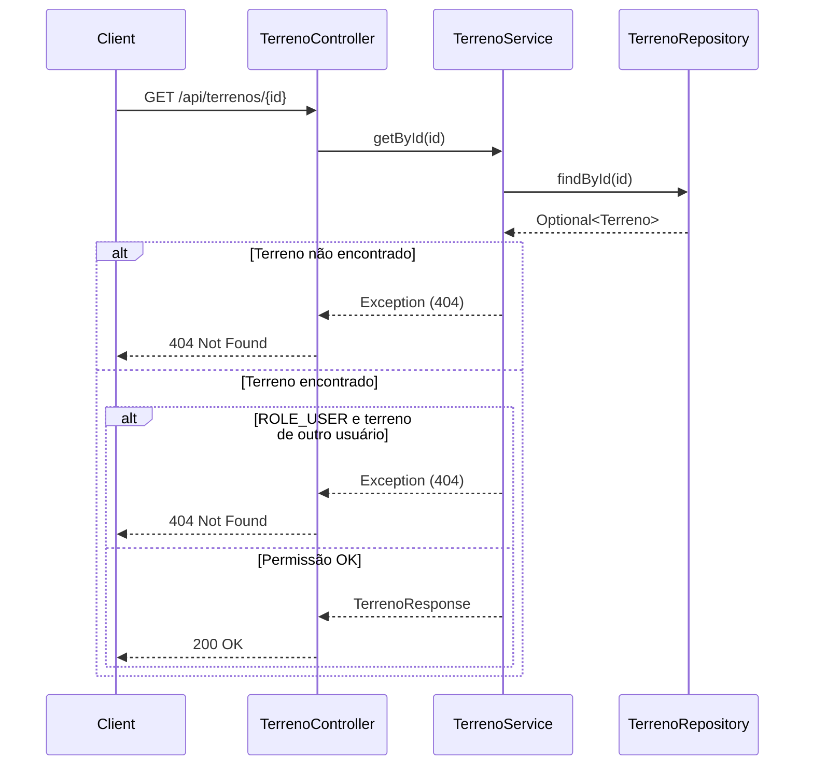
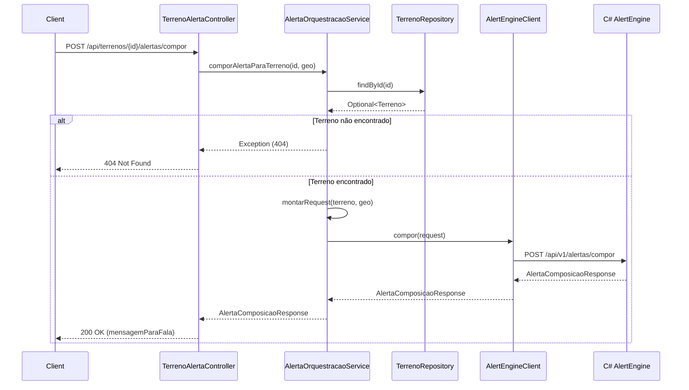
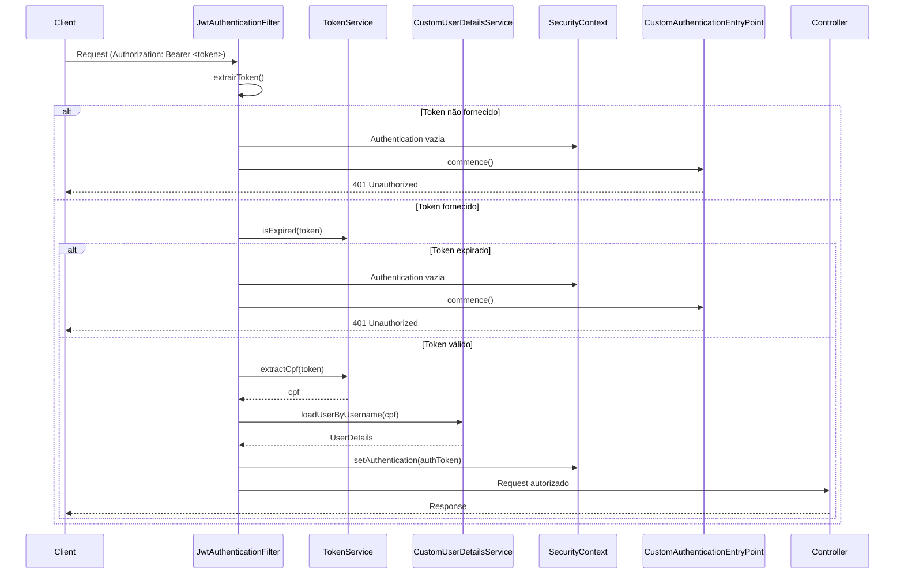
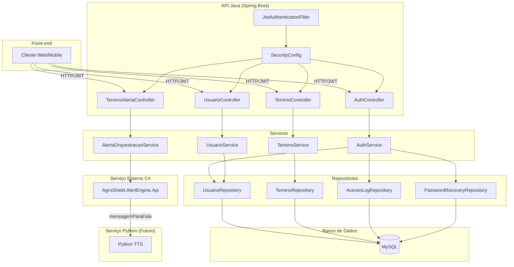
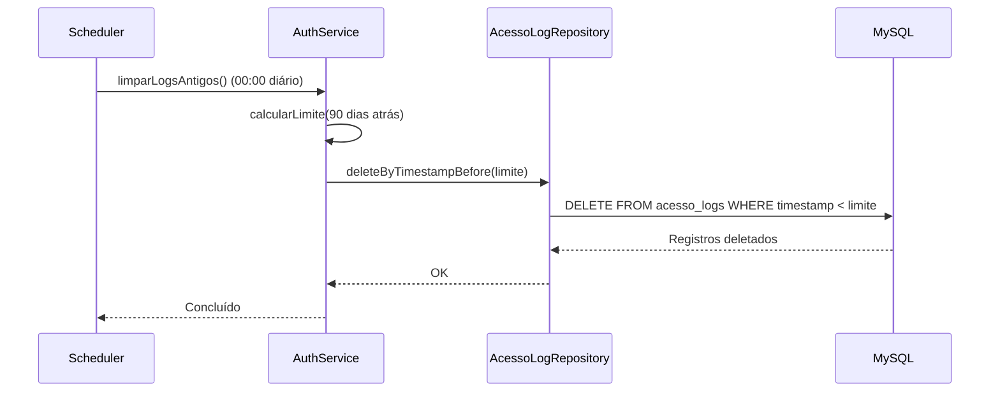

# Diagramas de Fluxo - AgroShield

## 1. Fluxo de Autenticação (Login)

## 2. Fluxo de Recuperação de Senha

## 3. Fluxo de CRUD de Terrenos

## 4. Fluxo de Composição de Alertas

## 5. Fluxo de Segurança JWT

## 6. Arquitetura do Sistema

## 7. Fluxo de Limpeza de Logs (Scheduled)

